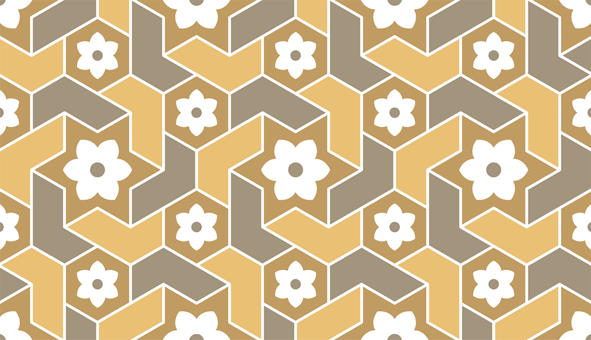

For some time I've been learning about Islamic geometric design, principally by drawing the patterns in Adobe Illustrator from photographs. I've also found the publications on Islamic design by Eric Broug really helpful. I've started a new repository of files and will be adding drawings there over the next few weeks as I tidy them up. 

Here's the first one, which I saw in January 2023 during a visit to the tomb of Itimad-ud-Daulah in Agrah, India. It's a clever tiled design based on a six-fold (hexagonal) repeating pattern.

[Go to the GitHub repository](https://github.com/nerdimmunity/islamic-geometric-design)

