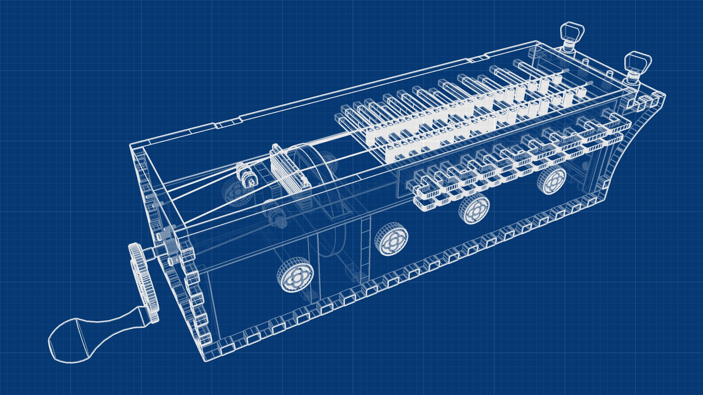

This is the most complex laser cutting project I have done, even though the instrument itself is relatively simple for a hurdy gurdy. Strictly this is a symphonie, a simple box-shaped hurdy gurdy with four strings. You turn the handle to move the wheel against the strings, and press the keys to fret different notes. The instrument has two chanter (melody) strings which give chromatic notes over two octaves from G, and two drone strings. It has a hinged lid.

My design is an adaptation of various others I found on the internet, but I want to particularly credit the plans for a symphonie by [Graeme McCormack](https://sites.google.com/site/gurdymaking/home/seoras-the-travel-sinfonye) which were very helpful. I made a number of short-cuts and simplifications to allow the instrument to be laser cut, and I'm sure that his design is a better instrument, so if you have the skills to hand-make a hurdy gurdy (I don't) I suggest you check out his excellent site. 

The crank was cut from brass sheet using a water jet cutter, and some parts (handle, tuning pegs, axle) were purchased from eBay. Other parts were cut either from laser ply or black acrylic sheet. I added a number of inlays with Islamic geometric designs cut from acrylic. There are two internal microphones (simple piezo designs which can be glued to the wood) which output to two jacks beneath the tuning pegs. I put one mic under the sound board near the bridge, and another closer to one of the drone bridges. There is a volume knob for each microphone. 



The wheel was cut from acrylic and then finished on a lathe. The bridge took a bit of time to design, and consists of a floating upper part that rests on two metal rods, each with an adjustable thumbwheel so that fine adjustments to the height of the bridge can be made on each side. The bridges for the drone strings are also adjustable. 

Overall I would say this was a partial success. It doesn't play particularly well and the microphones pick up too much internal noise from the keys and wheel. If I was making another one I'd have a second bridge by the tuning pegs and true the wheel on the spindle in situ, rather than trying to do it on a lathe - it's almost impossible to get the wheel evenly pressing against the strings otherwise. I'd also probably dispense with the internal microphones and just record it with an external microphone. 

[Go to the GitHub repository](https://github.com/nerdimmunity/laser-cut-hurdy-gurdy)

