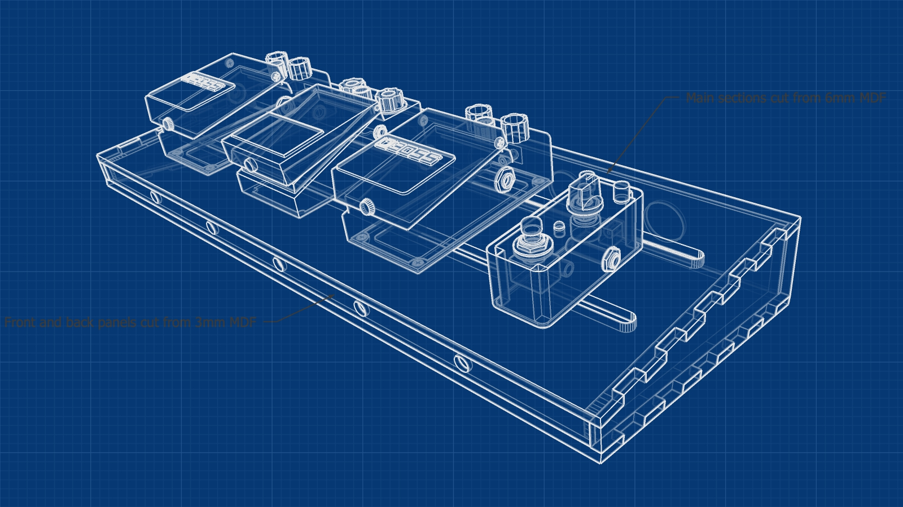

This is a simple guitar pedal board, laser cut from MDF. It is wide enough to take 4-5 pedals and the space under the board takes a power supply to keep everything nice and tidy. 

The main sections are laser cut from 6mm MDF, with front and back plates in 3mm MDF. The front plate was glued in place, the back plate is a snug fit and is just pressed into the recess at the back so that it can be removed to access to the power supply. I use short cables between pedals and run the extra flex into the unit via the slots on the top. 

I sanded and primed the MDF and then gave it a couple of coats of matt black spray paint. Velcro strips were placed along the top to fix the pedals in place. 

[Go to the GitHub repository](https://github.com/nerdimmunity/laser-cut-pedalboard)

